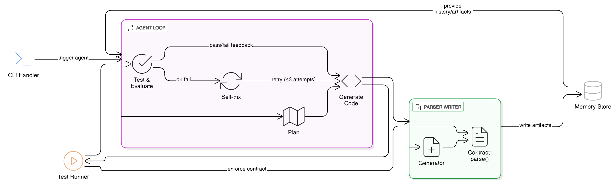

# Agent-as-Coder — Bank Statement PDF Parser Generator

**Automated bank-statement PDF parser generator using AI Agent**

This project implements an AI agent that generates Python parsers for bank statement PDFs using LLM-driven code generation. The agent analyzes sample PDFs and CSVs, then automatically generates, tests, and fixes parser code through an iterative loop.

---

##  Quick Start (5 Steps)

### 1. Clone Repository
```
git clone <your-repo-url>
cd ai-agent-AutoParser
```

### 2. Create Virtual Environment
```
python -m venv .venv
```
# Activate it
# Windows:
```
.venv\Scripts\activate
```

### 3. Install Dependencies
```
pip install -r requirements.txt
```

### 4. Set Up Gemini API Key
```
# Create .env file
GEMINI_API_KEY=your-actual-key-here
```

### 5. Run the Agent
```
# Generate parser for ICICI bank
python agent.py --target icici

# Run tests to verify
pytest -q
```

---

##  Agent Architecture



---

##  Usage Examples

```
# Basic usage
python agent.py --target icici

# More attempts (up to 5)
python agent.py --target icici --attempts 5

# Use different Gemini model
python agent.py --target icici --model gemini-2.5-pro

# Quiet mode
python agent.py --target icici --quiet
```

---

##  What It Does

1. **Analyzes** your PDF structure and CSV schema
2. **Creates** an extraction plan using Gemini AI
3. **Generates** Python parser code (`custom_parsers/<bank>_parser.py`)
4. **Tests** the parser automatically using pytest
5. **Self-fixes** errors by analyzing failures and regenerating code
6. **Repeats** up to 3 times until tests pass

**Generated parser exposes**: `parse(pdf_path: str) -> pd.DataFrame`

---

##  Testing
```
# Test specific parser
pytest tests/test_parsers.py::test_icici_parser -v

# All tests
pytest -v

# Quick test
pytest -q
```

---

##  Parser Contract

Generated parsers must follow this contract:

```python
def parse(pdf_path: str) -> pd.DataFrame:
    """Parse bank statement PDF and return DataFrame matching CSV schema."""
    # Generated code here
    return dataframe
```

The DataFrame must match the expected CSV columns, types, and values exactly.

---

##  Adding New Banks

1. Create directory: `data/<bank_name>/`
2. Add sample PDF: `data/<bank_name>/<bank>.pdf`
3. Add expected CSV: `data/<bank_name>/result.csv`
4. Run: `python agent.py --target <bank_name>`
5. Add test in `tests/test_parsers.py` (follow existing pattern)

---

##  Technologies

- **Python 3.10+** (type hints, modern features)
- **Google Gemini AI** (code generation)
- **PDF Processing**: pdfplumber, pdfminer.six, PyPDF2
- **Data**: pandas
- **Testing**: pytest
- **Environment**: python-dotenv

---

**Ready to use!** Just add your Gemini API key and run `python agent.py --target icici` 
